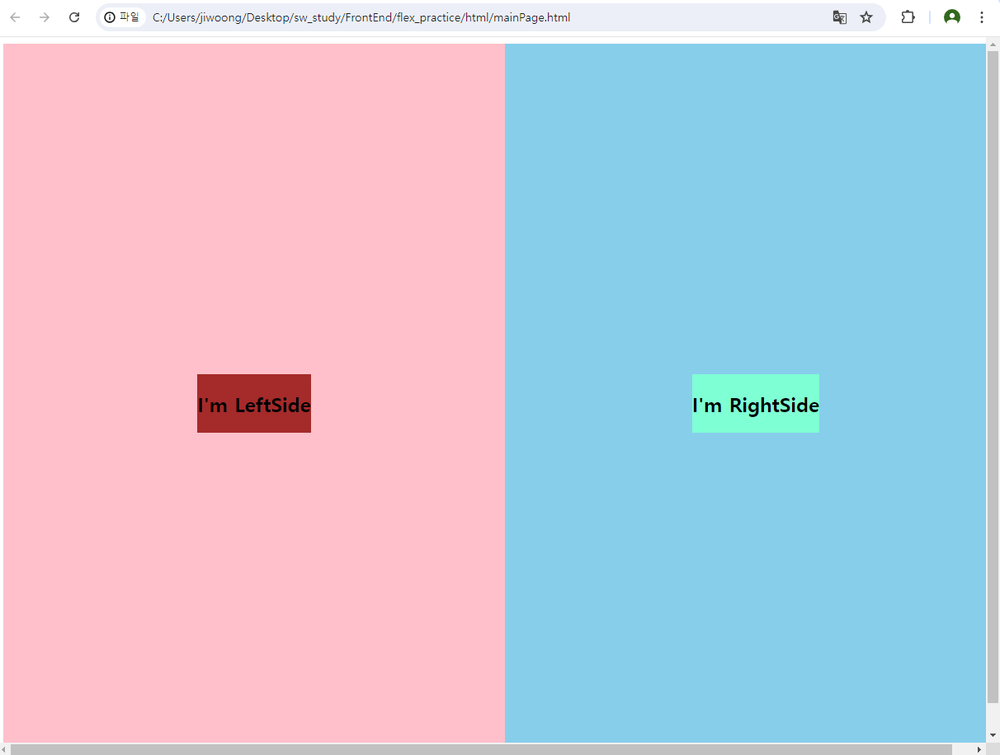

# flex
## 실습을 통한 flex 숙달
### html/mainPage.html

```css
.container {
    display: flex;
    flex-direction: row;
    height: 100dvh;
    width: 100dvw;
}
/* 우선, container의 width height 를 꽉 차게 한 후에, flex를 주고, 방향을 row 로 하였다. */
.leftside {
    flex: 1;
    display: flex;
    justify-content: center;
    align-items: center;
    background-color: pink;
}
.Innerleftside {
    background-color: brown;
}
.rightside {
    flex: 1;
    display: flex;
    justify-content: center;
    align-items: center;
    background-color: skyblue;
}
.InnerRightside {
    background-color: aquamarine;
}
/* 이후 right, left 각각 flex: 1을 줘 동등한 공간을 차지하도록 했고, justify content / align item center을 통해 내용을 중앙에 배치했다. */
```
## flex direction 참고


### html/Home.html

- html/Home.html, html/Home_2.html 확인해보기
- flex-grow의 용도, 두 방식이 어떤 차이가 있는지 (Home.html은 강의를 보며, Home_2.html은 혼자 만들어봄.)