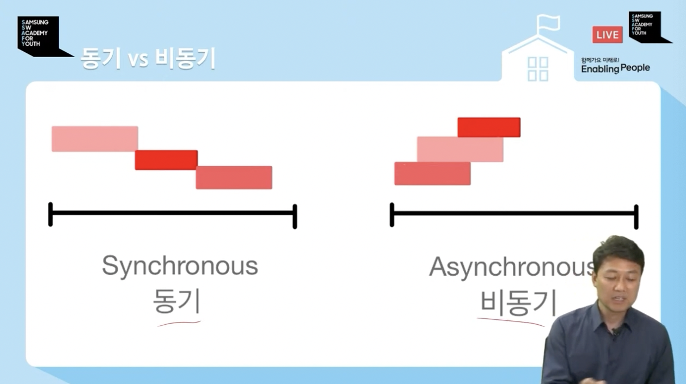

# async, await ...는 왜쓰나 궁금했었음
# 동기 : 순차처리, 비동기 : 병렬

- cpu Idle상태가 많은 것들만 비동기 처리 가능
    - 파일 read/write ... disk가 주
    - Network I/O ... 서버 응답까진 cpu가 쉬고 있음 (외부 작업이 더 많음)
    - Timer ... 그 시간동안 cpu 쉬고있음

# 비동기함수
```js
// 타이머, delay 이후 word를 return하는 함수
function delay_word(word, delay) {
    return new Promise(resolve => {
        setTimeout(function (){
            resolve(word)
        }, delay)
    })
}
```
## 비동기처리
### Chaining - promise방식
- 비동기함수이지만, 동기 방식으로 Task를 처리하는 것.
- 하나의 비동기 함수가 지난 후, 그 결과에 따라 다음 Task 실행여부를 따져야 하는 경우 활용
```js
delay_word('SAMSUNG', 500).then((resolve) => {
    // SAMSUNG을 500ms 이후에 출력해라
	console.log(resolve)

	delay_word('SW', 490).then((resolve) => { 

		console.log(resolve)
		
		delay_word('ACADEMY', 480).then((resolve) => {
			
			console.log(resolve)

			delay_word('FOR', 470).then((resolve) => {

				console.log(resolve)

				delay_word('YOUTH', 460).then((resolve) => {

					console.log(resolve)
				})
			})
		})
	})
})
```
### Chaining - async, await 방식
```js
async function test(){
	const resolve_0 = await delay_word('SAMSUNG', 500)
	console.log(resolve_0)
	const resolve_1 = await delay_word('SW', 490)
	console.log(resolve_1)
	const resolve_2 = await delay_word('ACADEMY', 480)	
	console.log(resolve_2)
	const resolve_3 = await delay_word('FOR', 470)
	console.log(resolve_3)
	const resolve_4 = await delay_word('YOUTH', 460)
	console.log(resolve_4)
}
```
- 둘다 논리적으로 똑같음. 일관성있게 하나의 방식으로만 사용하자.

### 비동기 함수 사용 (병렬적 Task처리) - 비순차적 return
- 먼저 처리가 끝나는 것 출력
```js
function delay_word(word, delay) {
  return new Promise(resolve => {
    setTimeout(function (){
      resolve(word)
    }, delay)
  })
}


const array = [{word:'SAMSUNG', delay:500}, {word:'SW', delay:490}, {word:'ACADEMY', delay:480}, {word:'FOR', delay:470}, {word:'YOUTH', delay:460}]


array.forEach(async (item) => {
	
	const resolve = await delay_word(item.word, item.delay)
	
	console.log(resolve)
	
})
// delay가 짧은 것 순으로 출력됨
```
### 비동기 함수 사용 (병렬적 Task처리) - 순차적 return
```js
function delay_word(word, delay) {
  return new Promise(resolve => {
    setTimeout(function (){
      resolve(word)
    }, delay)
  })
}


const array = [{word:'SAMSUNG', delay:500}, {word:'SW', delay:490}, {word:'ACADEMY', delay:480}, {word:'FOR', delay:470}, {word:'YOUTH', delay:460}]

const promise_list = []

array.forEach((item) => {

	const promise = delay_word(item.word, item.delay)

	promise_list.push(promise)
})

Promise.all(promise_list).then((values) => {

	values.forEach((resolve) => {console.log(resolve)})
})
// chaining과 결과가 같지만 처리 과정 다르다.
```