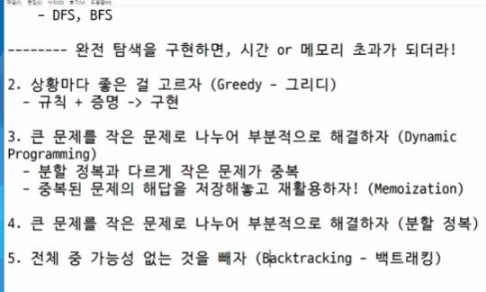

# 분할 정복 기법
1. 해결할 문제를 여러개의 작은 부분으로 나눈다.
2. 나눈 작은 문제를 각각 해결한다.
3. 필요한 경우 작은 문제들을 결합해 결론을 도출한다.

    **재귀를 통해 구현**

# 병합 정렬(Merge Sort)
- O(n log n)
- 최소 크기의 부분집합이 될 때까지 분할 작업을 계속하고 이후 이를 병합하며 정렬하는 알고리즘
- **SWEA 병합정렬 문제 다시 풀며 숙달하기!**

# 퀵 정렬
- 이코테 퀵정렬 확인하기

# 이진검색
- 중앙의 항목 키값과 비교하여 검색의 위치를 결정하고 검색을 계속 진행하는 방법
- 이진검색을 위해선 정렬되어 있어야 한다.
```python
lst = [1,3,2,4,5,6]
# 1. 정렬
lst.sort()
# 이진검색 (반복문)
def bin_search(target):
    # 맨 끝 idx
    low = 0
    high = len(lst) - 1

    while low <= high: # low, high 교차되는 경우 종료
        mid = (low + high) // 2
        # 종료조건 1 : mid가 목표 숫자
        if lst[mid] == target:
            return mid
        elif lst[mid] > target:
            high = mid - 1 # 범위 재설정
        elif lst[mid] < target:
            low = mid + 1 # 범위 재설정
    # 못찾는 경우 -1
    return -1

# 이진탐색(재귀)
def bin_search2(start, end, target):
    if start > end:
        return
    mid = (start + end) // 2
    
    if target == lst[mid]:
        return mid
    
    if target > lst[mid]:
        return bin_search2(mid + 1, end, target)
    elif target < lst[mid]:
        return bin_search2(start, mid-1, target)
```
