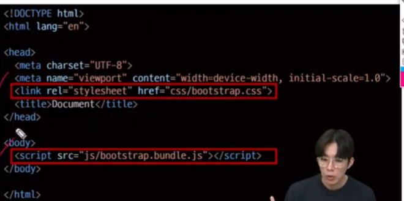

# Bootstrap
- CSS 프론트엔드 프레임워크 (Toolkit)

# CDN
- 서버와 사용자 사이의 물리적 거리를 줄여 로딩 시간 단축

# bootstrap 기본 사용법

#  Reset Css
- 모든 브라우저에 동일하게 보이도록 하기 위해
- 대표적인 방법으로는 normalize CSS라고 한다.

# 파일로 불러오는 방법

# 시멘틱 태그
- 재사용성을 높이고 빠른 파악을 위한 규칙 중 하나

# OOCSS
1. 구조와 스킨을 분리
    - 모든 것의 공통 구조를 정의
    - 이후 각각을 정의
2. 컨테이너와 콘텐츠를 분리
 