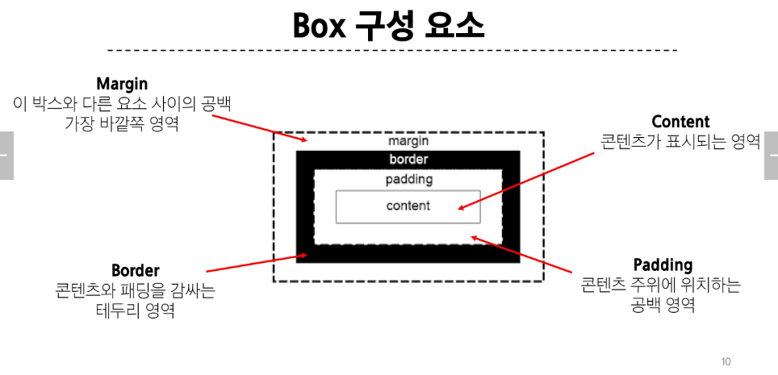
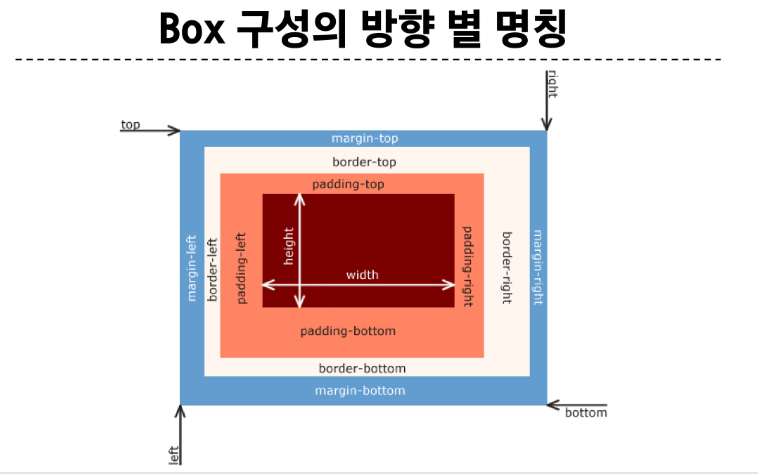

# CSS Box Model
- 내용(content), 안쪽여백(padding), 테두리(border), 외부 간격(margin)으로 구성되는 개념



- CSS는 border가 아닌 content의 크기로 width값을 지정한다.(default)
- box-sizing: border-box; 로 새로 선언하면 content가 아닌 border로 사이즈 정할 수 있음.

## Block & Inline
1. Block
- 항상 새로운 행으로 나뉜다.
- width와 height 속성을 사용하여 너비와 높이를 지정할 수 있다.
- 기본적으로 width 속성을 지정하지 않으면, 박스는 inline 방향으로 사용 가능한 공간을 모두 차지한다. (행 방향으로 일자로 쭉, 너비를 100%로 채움)
```
block type tag
- h1~h6
- p
- div
```
2. Inline
- 새로운 행으로 나뉘지 않는다.
- width와 height 속성을 사용할 수 없다.
```
수직방향 : padding, margins, borders가 적용되지만 다른 요소를 밀어낼 수는 없다.
수평방향 : padding, margins, borders가 적용되어 다른 요소를 밀어낼 수 있음.

대표적 inline tag
a, img, span
```
## display (inline-block)
- inline과 block 요소 사이의 중간 지점을 제공하는 display 값
- width, height 속성 사용 가능
- padding, margin, border로 인해 다른 요소가 밀려난다
**요소가 줄 바꿈 되는 것을 원하지 않으면서 너비와 높이를 적용하고 싶은 경우에 사용**

# CSS Position
- 요소를 Normal Flow 에서 제거하여 다른 위치로 배치하는 것
```
static : 기본
relative : 나의 static 위치를 기준으로 이동, 과거의 위치 또한 차있음
absolute : 본인의 과거를 버림(static 위치 차지함을 포기), static이 아닌 부모를 찾고 이동하기 시작한다.
fixed : 브라우저를 기준으로 해당 위치에 고정
sticky : 일반적인 상황에선 normal flow에 따라 배치, 하지만 스크롤이 특정 임계점에 도달하면 그 위치에서 고정된다.
```
- z-index : z index를 강제로 지정해 겹치는 경우 무엇이 위에 있을지 지정할 수 있다.

# CSS Flexbox
- 요소를 행과 열의 형태로 1차원 레이아웃 방식
- 행과 열을 만들고 이를 몇대몇으로 나눈다던지 ...
```
Flexbox 구성요소
1. Flex container (부모, 핵심!)
2. Flex item
```
## Flex Container
- display: flex; 혹은 display: inline-flex;가 설정된 부모요소

## Flex Item
- Flex Container 내부 구성 요소

### Flex 명령어 (Container)
```
flex-direction: (col, row, col-rev, row-rev) ... main 축 변경

flex-wrap: wrap;
- item크기를 유지하고 뷰포트가 작아진다면 이를 아래로 내릴 것이냐

justify-content: flex-start/flex-end/center
- flex container 내 item들 정렬! (main축 기준)

align-content: flex-start/flex-end/center
- 수직 축 기준 flex container 내 item들 정렬! 
```
+. content : 여러줄, items : 한줄

### Flex 명령어 (Item)
```
align-self: flex-start/flex-end/center
- 부모 container의 명령 외 item들이 개별적으로 이동해야 하는 경우
```

### Flex Grow
- 빈 공간을 요소에 할당하여 브라우저 한 줄을 채움. 1,2,3으로 flex-grow를 할당했다면 이는 1대2대3이 아니다. 단순히 남는 공간을 1대2대3으로 나눈 것!

### Flex basis
- 기본 값을 지정하는 것(초기값)

